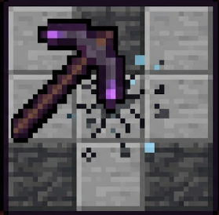

# 🪓 VoidPickaxe

  

  <b>A lightweight and optimized 3×3 mining plugin for Minecraft Paper servers</b>

---

## ⚡ Overview

VoidPickaxe is a custom mining plugin that introduces a powerful **Void PickAxe** capable of mining blocks in a clean **3×3 area instantly**.

Designed with performance in mind — no particles, no unnecessary effects, and no lag-heavy systems.

---

## ✨ Features

- 🪓 Custom **Netherite Void PickAxe**
- 🟣 Purple styled item name: *Void PickAxe*
- ⛏️ Mines **3×3 blocks instantly**
- ⚡ Clean and optimized mining logic
- 🚫 No particles → reduced server load
- 🧠 Stable and predictable mining pattern
- 🔒 Non-craftable (admin controlled only)
- 💎 Safe for survival servers

---

## 💬 Commands

### 🛠 Admin Commands
